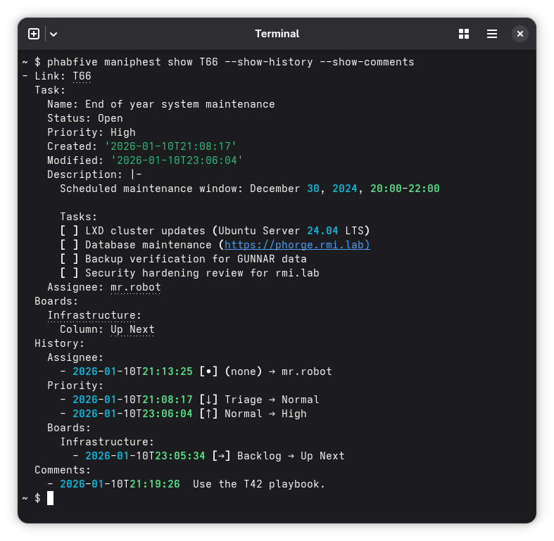

# phabfive

A command line tool to interact with [Phabricator](https://www.phacility.com/phabricator/) and [Phorge](https://www.phorge.it/).



## Features

A summary of the currently supported features:

- **Passphrase** - Get specified secret
- **Diffusion** - List repositories, get branches, clone URIs, add repositories, manage URIs
- **Paste** - List, get, and add pastes
- **User** - Get information about the logged-in user
- **Maniphest** - Add comments, show task details, create tasks from templates, search with advanced filters
- **Edit** - Edit tasks with auto-detection, batch operations, and smart board/column navigation

For complete documentation, see [Read the Docs](https://phabfive.readthedocs.io/).

## Installation

[uv](https://docs.astral.sh/uv/) is a fast Python package installer (10-100x faster than pip):

```bash
# Install uv if you haven't already
curl -LsSf https://astral.sh/uv/install.sh | sh

# Install from pypi.org
uv tool install phabfive

# Install from Github to get unreleased features and fixes
uv tool install git+https://github.com/dynamist/phabfive@master
```

If you prefer [mise-en-place](https://mise.jdx.dev/) the polyglot tool version manager:

```bash
# Install mise if you haven't already
curl https://mise.run | sh

# Install from pypi.org
mise use --global --pin pipx:phabfive
```

## Quick Start

### 1. Get an API token

Grab a Phabricator/Phorge token at `https://<yourserver.com>/settings/panel/apitokens/`

### 2. Configure credentials

**Environment variables:**

```bash
export PHAB_TOKEN=cli-ABC123
export PHAB_URL=https://yourserver.com/api/
```

**Or use a configuration file:**

```bash
# Linux/XDG
cat << 'EOF' > ~/.config/phabfive.yaml
PHAB_TOKEN: cli-ABC123
PHAB_URL: https://yourserver.com/api/
EOF

# macOS
cat << 'EOF' > ~/Library/Application\ Support/phabfive.yaml
PHAB_TOKEN: cli-ABC123
PHAB_URL: https://yourserver.com/api/
EOF

# Windows - create at: %LOCALAPPDATA%\phabfive\phabfive.yaml
```

**Note:** On macOS, you can use `~/.config` by setting `export XDG_CONFIG_HOME=~/.config`

### 3. Use phabfive

```bash
# Get secrets and list pastes
phabfive passphrase K123
phabfive paste list

# Search and edit tasks
phabfive maniphest search "migration tasks" --tag myproject
phabfive maniphest search --tag myproject --updated-after=7

# Edit tasks individually or in batch
phabfive edit T123 --priority=high --status=resolved
phabfive maniphest search --assigned=@me | phabfive edit --column=Done
```

## Documentation

- **[Full CLI Reference](https://phabfive.readthedocs.io)** - Complete command documentation
- **[Development Guide](docs/development.md)** - Set up dev environment, run tests, local Phorge/Phabricator setup
- **[Release Process](docs/releasing.md)** - How to build and publish releases

## Contributing

See [docs/development.md](docs/development.md) for instructions on setting up your development environment.

## License

Copyright (c) 2017-2026 Dynamist AB

See the LICENSE file provided with the source distribution for full details.
