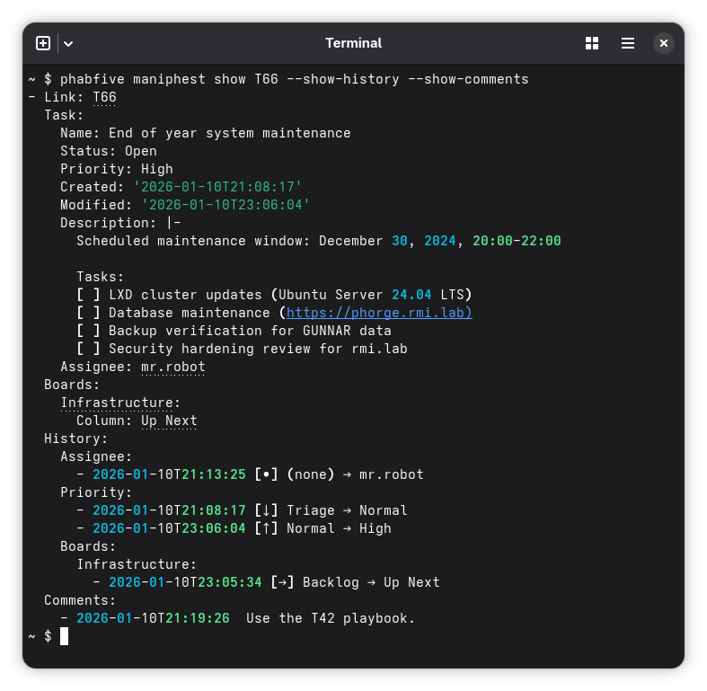

# phabfive

CLI for [Phabricator](https://www.phacility.com/phabricator/) and [Phorge](https://we.phorge.it/) - built for humans and AI agents.



## Features

- **Maniphest** - Full task management: create, show, edit, search, comment, parents/subtasks
- **Paste** - Create, show, edit, search, and comment on pastes
- **Diffusion** - Repository management, branches, and URI configuration
- **Passphrase** - Search, list, and retrieve secrets (passwords, tokens, SSH keys, notes)
- **User** - User info and interactive setup wizard

Cross-cutting features:

- **Monogram shortcuts** - `phabfive T123` expands to `phabfive maniphest show T123`
- **Batch editing** - Edit multiple objects at once: `phabfive edit T1,T2,T3 --status=resolved`
- **Shell completion** - Tab completion for commands, options, and values
- **Machine-readable output** - `--format=json` or `--format=yaml` for scripting and AI agents

For complete documentation, see [Read the Docs](https://phabfive.readthedocs.io/).

## Installation

[uv](https://docs.astral.sh/uv/) is a fast Python package installer (10-100x faster than pip):

```bash
# Install uv if you haven't already
curl -LsSf https://astral.sh/uv/install.sh | sh

# Install from pypi.org
uv tool install phabfive

# Install from Github to get unreleased features and fixes
uv tool install git+https://github.com/dynamist/phabfive@master
```

If you prefer [mise-en-place](https://mise.jdx.dev/) the polyglot tool version manager:

```bash
# Install mise if you haven't already
curl https://mise.run | sh

# Install from pypi.org
mise use --global --pin pipx:phabfive
```

## Quick Start

Run the interactive setup wizard:

```bash
phabfive user setup
```

The wizard will prompt for your Phabricator/Phorge URL and API token, then store them in `~/.arcrc` (Arcanist-compatible format). If you have multiple servers configured, phabfive will let you choose which one to use.

Then start using phabfive:

```bash
# Show tasks and pastes with monogram shortcuts
phabfive T123
phabfive P456

# Search and filter
phabfive maniphest search "migration tasks" --tag myproject
phabfive paste search "config"

# Create and edit
phabfive maniphest create "Fix the bug" --priority=high --tag myproject
phabfive maniphest edit T123 "New Title" --status=resolved

# Smart navigation - raise/lower priority, move columns forward/backward
phabfive edit T123 --priority=raise
phabfive edit T123 --tag=MyBoard --column=forward

# Batch operations
phabfive edit T1,T2,T3 --status=resolved
phabfive maniphest search --assigned=@me | phabfive edit --column=Done
```

## Shell Completion

Enable tab completion for bash, zsh, or fish:

```bash
phabfive --install-completion bash
phabfive --install-completion zsh
phabfive --install-completion fish
```

After installation, restart your shell or source your profile.

<details>
<summary>Manual configuration (advanced)</summary>

**Arcanist-compatible `~/.arcrc`** (recommended):

```json
{
  "hosts": {
    "https://yourserver.com/api/": {
      "token": "cli-ABC123"
    }
  }
}
```

**Or environment variables:**

```bash
export PHAB_TOKEN=cli-ABC123
export PHAB_URL=https://yourserver.com/api/
```

**Windows SSL certificates:** If you encounter certificate errors, install [pip-system-certs](https://pypi.org/project/pip-system-certs/) to use the Windows certificate store: `pip install pip-system-certs`

</details>

## Documentation

- **[Full CLI Reference](https://phabfive.readthedocs.io)** - Complete command documentation
- **[Development Guide](docs/development.md)** - Set up dev environment, run tests, local Phorge/Phabricator setup
- **[Release Process](docs/releasing.md)** - How to build and publish releases

## Contributing

See [docs/development.md](docs/development.md) for instructions on setting up your development environment.

## License

Copyright (c) 2017-2026 Dynamist AB

See the LICENSE file provided with the source distribution for full details.
